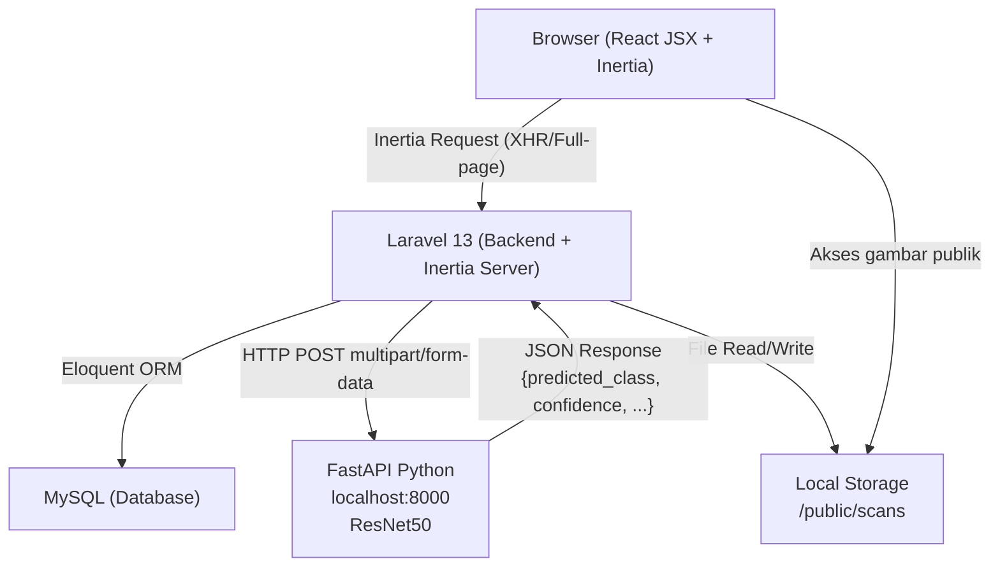
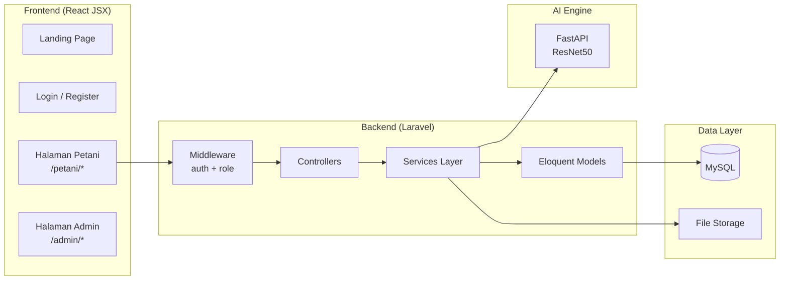
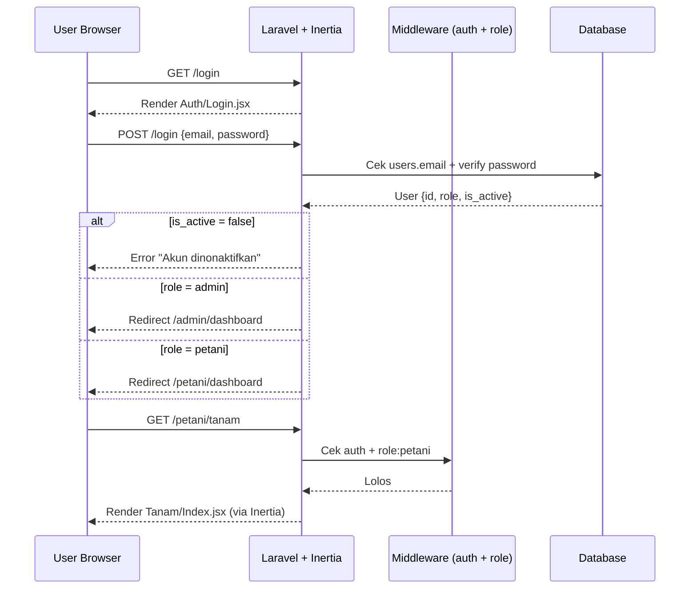
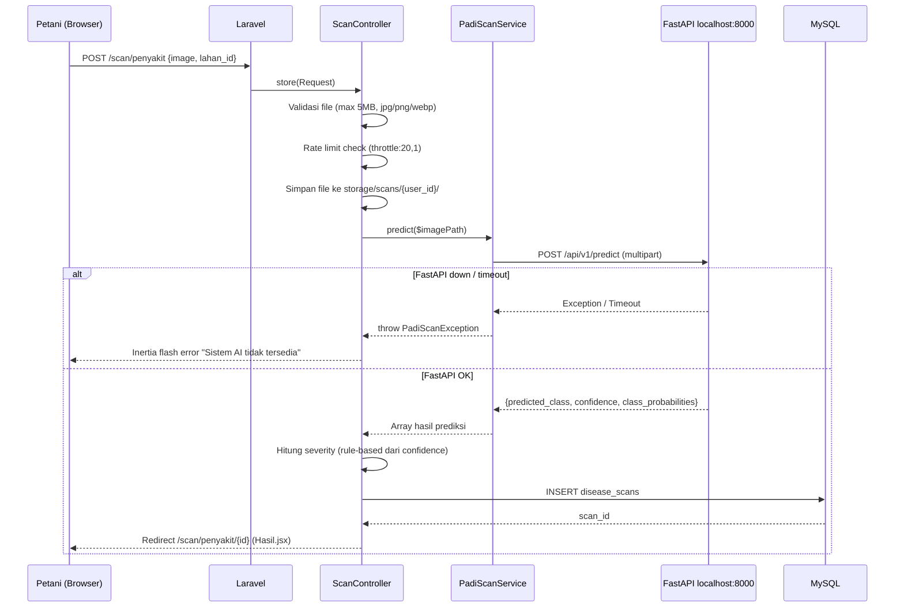
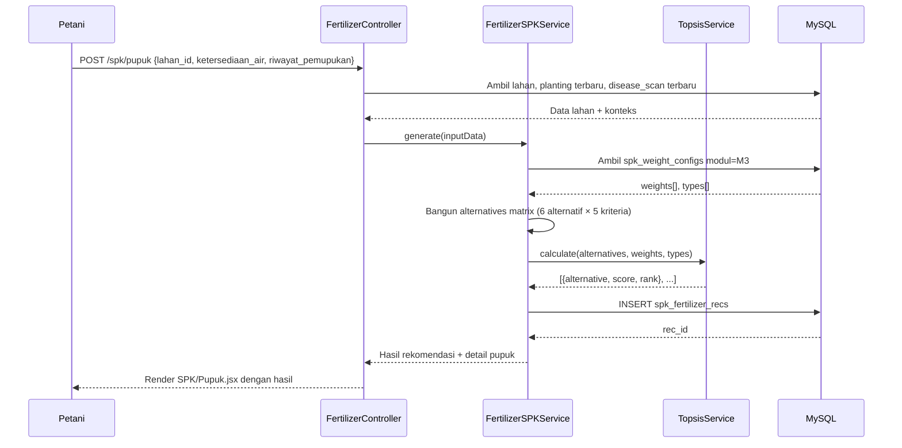
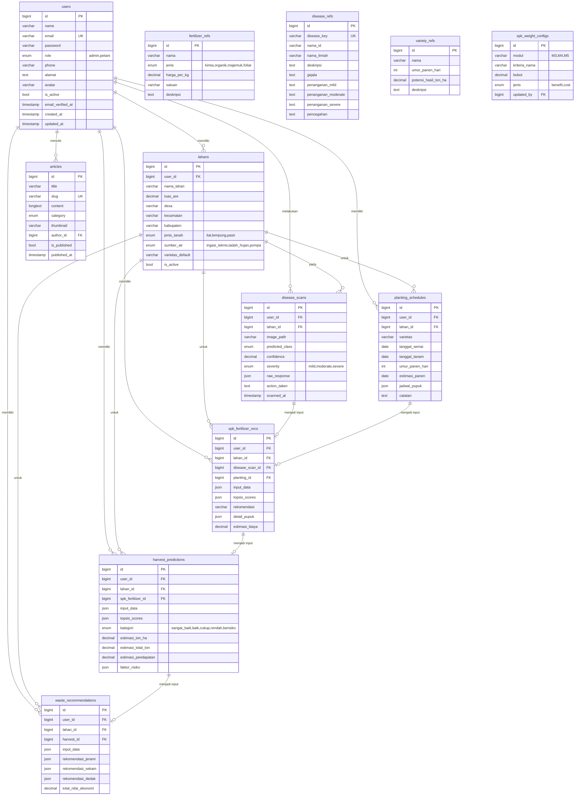

# Dokumen Desain: Platform BathariSri v3.0

## Overview

BathariSri adalah platform web berbasis AI untuk petani padi muda Indonesia. Sistem mengintegrasikan Computer Vision (Modul 2 – Deteksi Penyakit Daun menggunakan ResNet50 via FastAPI), Decision Support System berbasis TOPSIS (Modul 3 – Rekomendasi Pupuk, Modul 4 – Prediksi Panen, Modul 5 – Rekomendasi Limbah), dan Kalkulator Agronomi rule-based (Modul 1 – Jadwal Tanam) — seluruhnya dalam satu antarmuka web Laravel 13 + Inertia.js + React JSX + Tailwind CSS.

Platform ini dirancang untuk 2 role: **admin** (pengelola platform) dan **petani** (end user). Migrasi dari skema database v2 ke v3 merupakan bagian dari rilis ini, menggantikan tabel `smart_nurseries`, `ai_diagnoses`, `smart_wastes`, dan `nursery_logs` dengan skema baru yang lebih terstruktur.

---

## Architecture





---

## Diagram Alur Request Utama

### Alur Autentikasi dan Role Routing



### Alur Modul 2 – Deteksi Penyakit



### Alur TOPSIS (Modul 3, 4, 5)



---

## Components and Interfaces

### Lapisan Routing dan Middleware

**Middleware: RoleMiddleware**

```php
// app/Http/Middleware/RoleMiddleware.php
class RoleMiddleware {
    public function handle(Request $request, Closure $next, string $role): Response
    // Precondition: User sudah terautentikasi (middleware auth berjalan lebih dulu)
    // Postcondition: Jika user->role !== $role, abort(403)
    //                Jika sesuai, lanjutkan ke controller berikutnya
}
```

**Registrasi di bootstrap/app.php:**
```php
->withMiddleware(function (Middleware $middleware) {
    $middleware->alias([
        'role' => RoleMiddleware::class,
    ]);
})
```

**Struktur Route:**
```php
// Publik
Route::get('/', WelcomeController::class);

// Autentikasi (Breeze sudah ada)
require __DIR__.'/auth.php';

// Petani
Route::middleware(['auth', 'role:petani'])->prefix('petani')->name('petani.')->group(function () {
    Route::get('/dashboard', [PetaniDashboardController::class, 'index'])->name('dashboard');
    Route::resource('/lahan', LahanController::class);
    Route::resource('/tanam', PlantingController::class)->except(['edit','update']);
    Route::get('/scan/penyakit', [ScanController::class, 'index'])->name('scan.index');
    Route::post('/scan/penyakit', [ScanController::class, 'store'])->name('scan.store')
         ->middleware('throttle:20,1');
    Route::get('/scan/penyakit/{scan}', [ScanController::class, 'show'])->name('scan.show');
    Route::get('/spk/pupuk', [FertilizerController::class, 'create'])->name('spk.pupuk');
    Route::post('/spk/pupuk', [FertilizerController::class, 'store'])->name('spk.pupuk.store');
    Route::get('/spk/panen', [HarvestController::class, 'create'])->name('spk.panen');
    Route::post('/spk/panen', [HarvestController::class, 'store'])->name('spk.panen.store');
    Route::get('/spk/limbah', [WasteController::class, 'create'])->name('spk.limbah');
    Route::post('/spk/limbah', [WasteController::class, 'store'])->name('spk.limbah.store');
    Route::get('/artikel', [ArtikelController::class, 'index'])->name('artikel.index');
    Route::get('/artikel/{slug}', [ArtikelController::class, 'show'])->name('artikel.show');
});

// Admin
Route::middleware(['auth', 'role:admin'])->prefix('admin')->name('admin.')->group(function () {
    Route::get('/dashboard', [AdminDashboardController::class, 'index'])->name('dashboard');
    Route::resource('/users', AdminUserController::class)->only(['index','show']);
    Route::patch('/users/{user}/toggle', [AdminUserController::class, 'toggle'])->name('users.toggle');
    Route::get('/scan', [AdminScanController::class, 'index'])->name('scan.index');
    Route::get('/scan/export', [AdminScanController::class, 'export'])->name('scan.export');
    Route::resource('/referensi/pupuk', AdminFertilizerRefController::class);
    Route::resource('/referensi/penyakit', AdminDiseaseRefController::class);
    Route::resource('/referensi/varietas', AdminVarietyRefController::class);
    Route::resource('/referensi/harga', AdminCommodityPriceController::class);
    Route::resource('/referensi/limbah', AdminWastePriceRefController::class);
    Route::get('/spk', [AdminSpkController::class, 'index'])->name('spk.index');
    Route::put('/spk', [AdminSpkController::class, 'update'])->name('spk.update');
    Route::post('/spk/reset', [AdminSpkController::class, 'reset'])->name('spk.reset');
    Route::resource('/artikel', AdminArtikelController::class);
});
```

---

### Lapisan Services

#### TopsisService (Universal — dipakai M3, M4, M5)

```php
// app/Services/TopsisService.php
class TopsisService {
    /**
     * Menghitung ranking TOPSIS untuk sejumlah alternatif.
     *
     * @param array $alternatives ['A1' => [val1, val2, ...], 'A2' => [...]]
     *              Nilai sudah dalam bentuk numerik (skala 1–5)
     * @param array $weights      [0.25, 0.22, 0.20, 0.18, 0.15]
     *              Jumlah total harus = 1.0 (toleransi floating point ±0.001)
     * @param array $types        ['benefit', 'cost', 'benefit', ...]
     *              Panjang harus sama dengan jumlah kriteria
     * @return array [
     *     ['alternative' => 'A1', 'score' => 0.87, 'rank' => 1],
     *     ...
     * ] — sudah diurutkan dari rank 1 (terbaik)
     */
    public function calculate(array $alternatives, array $weights, array $types): array

    /**
     * Langkah 1: Normalisasi matriks keputusan.
     * Setiap elemen dibagi dengan akar dari jumlah kuadrat kolomnya.
     * r_ij = x_ij / sqrt(sum(x_kj^2) untuk semua k)
     */
    private function normalize(array $matrix): array

    /**
     * Langkah 2: Matriks ternormalisasi tertimbang.
     * v_ij = w_j × r_ij
     */
    private function weight(array $normalized, array $weights): array

    /**
     * Langkah 3: Tentukan Solusi Ideal Positif (A+) dan Negatif (A-).
     * benefit: A+[j] = max(v_ij), A-[j] = min(v_ij)
     * cost:    A+[j] = min(v_ij), A-[j] = max(v_ij)
     */
    private function idealSolutions(array $weighted, array $types): array

    /**
     * Langkah 4 & 5: Hitung jarak Euclidean dan skor preferensi.
     * D+_i = sqrt(sum((v_ij - A+[j])^2))
     * D-_i = sqrt(sum((v_ij - A-[j])^2))
     * Ci = D-_i / (D+_i + D-_i)
     */
    private function computeScores(array $weighted, array $idealPos, array $idealNeg): array
}
```

#### PlantingCalculatorService

```php
// app/Services/PlantingCalculatorService.php
class PlantingCalculatorService {
    /**
     * Menghitung status pertumbuhan padi hari ini.
     *
     * @param Carbon $tanggal_tanam Tanggal tanam (bukan semai)
     * @param int    $umur_panen    Umur panen varietas dalam hari
     * @param Carbon $today         Tanggal hari ini (default: Carbon::today())
     * @return array [
     *     'hst'          => int,    // Hari Setelah Tanam, min 0
     *     'fase'         => string, // 'vegetatif_awal'|'vegetatif_aktif'|'reproduktif'|'pemasakan'|'panen'
     *     'fase_label'   => string, // Label bahasa Indonesia
     *     'fase_index'   => int,    // 0–3
     *     'progress_pct' => float,  // Persentase kemajuan musim tanam
     *     'next_event'   => string, // Deskripsi event berikutnya
     *     'days_to_next' => int,    // Hari menuju event berikutnya
     *     'alerts'       => array,  // Array pesan alert aktif
     * ]
     */
    public function calculatePhase(Carbon $tanggal_tanam, int $umur_panen, Carbon $today = null): array

    /**
     * Menghasilkan jadwal pemupukan dan milestone musim tanam.
     *
     * @param Carbon $tanggal_tanam
     * @param int    $umur_panen
     * @return array [
     *     ['event'          => string,  // 'Pupuk Dasar', 'Pupuk Susulan 1', dll
     *      'tanggal_mulai'  => Carbon,
     *      'tanggal_selesai'=> Carbon,
     *      'hst_mulai'      => int,
     *      'hst_selesai'    => int,
     *      'status'         => 'selesai'|'aktif'|'mendatang'],
     * ]
     */
    public function generateSchedule(Carbon $tanggal_tanam, int $umur_panen): array
}
```

#### PadiScanService (Sudah Ada — Kontrak Interface)

```php
// app/Services/PadiScanService.php
class PadiScanService {
    /**
     * Memanggil endpoint FastAPI untuk memprediksi penyakit daun padi.
     *
     * @param string $imagePath Path absolut ke file gambar di storage
     * @return array [
     *     'predicted_class'      => string,  // 'leaf_blast'|'bacterial_leaf_blight'|...
     *     'confidence'           => float,   // 0.0 – 1.0
     *     'class_probabilities'  => array,   // {'leaf_blast': 0.92, ...}
     * ]
     * @throws PadiScanException Jika FastAPI tidak dapat dijangkau atau error
     */
    public function predict(string $imagePath): array

    /**
     * Memeriksa apakah FastAPI server sedang berjalan.
     *
     * @return bool
     */
    public function isHealthy(): bool
}
```

#### FertilizerSPKService

```php
// app/Services/FertilizerSPKService.php
class FertilizerSPKService {
    public function __construct(private TopsisService $topsis) {}

    /**
     * Menjalankan SPK TOPSIS untuk rekomendasi pemupukan (Modul 3).
     *
     * @param array $input [
     *     'fase_pertumbuhan'  => string,  // 'vegetatif_awal'|...
     *     'kondisi_penyakit'  => string,  // 'healthy'|'mild'|'moderate'|'severe'
     *     'ketersediaan_air'  => string,  // 'baik'|'cukup'|'kurang'
     *     'jenis_tanah'       => string,  // 'liat'|'lempung'|'pasir'
     *     'riwayat_pemupukan' => string,  // 'belum_pupuk'|'sudah_dasar'|'sudah_susulan1'
     * ]
     * @param float $luas_are Luas lahan dalam satuan are
     * @return array [
     *     'rekomendasi'     => string,   // 'A1'|'A2'|...'A6'
     *     'nama_pupuk'      => string,
     *     'topsis_scores'   => array,    // Semua skor dan ranking
     *     'detail_pupuk'    => array,    // Jenis, dosis, jadwal
     *     'estimasi_biaya'  => float,    // Dalam Rupiah
     * ]
     */
    public function generate(array $input, float $luas_are): array
}
```

---

## Data Models

### Diagram ERD



---

## Algoritma dan Spesifikasi Formal

### Algoritma 1: Kalkulasi Fase Pertumbuhan Padi (Modul 1)

```php
/**
 * ALGORITMA: calculatePhase
 * INPUT : tanggal_tanam (Carbon), umur_panen (int > 0), today (Carbon)
 * OUTPUT: array status_hari_ini
 *
 * PRECONDITIONS:
 *   - umur_panen > 0
 *   - today >= tanggal_tanam (HST >= 0, nilai negatif dianggap 0)
 *   - umur_panen antara 90–180 (rentang biologis padi)
 *
 * POSTCONDITIONS:
 *   - hst >= 0
 *   - fase ∈ {'vegetatif_awal', 'vegetatif_aktif', 'reproduktif', 'pemasakan', 'panen'}
 *   - progress_pct ∈ [0.0, 100.0]
 *   - Jika hst ∈ [21,25] ATAU [40,45] ATAU [55,60]: alerts berisi peringatan pupuk
 *
 * LOOP INVARIANT (pada loop cek jadwal_pupuk):
 *   - Setiap item yang diperiksa memiliki 'hst_mulai' <= 'hst_selesai'
 *   - Status hanya ditetapkan sekali per item
 */
FUNCTION calculatePhase(tanggal_tanam, umur_panen, today):
    hst = max(0, today.diffInDays(tanggal_tanam))
    
    // Hitung batas fase berdasarkan umur varietas
    batas_reproduktif = round(umur_panen * 0.40)  // ~46 untuk 116 hari
    batas_pemasakan   = round(umur_panen * 0.58)  // ~67 untuk 116 hari
    
    IF hst > umur_panen THEN
        fase = 'panen'
        fase_label = 'Siap Panen / Pasca Panen'
        fase_index = 4
    ELSE IF hst >= batas_pemasakan THEN
        fase = 'pemasakan'
        fase_label = 'Fase Pemasakan (Pengisian Gabah)'
        fase_index = 3
    ELSE IF hst >= batas_reproduktif THEN
        fase = 'reproduktif'
        fase_label = 'Fase Reproduktif (Pembentukan Malai)'
        fase_index = 2
    ELSE IF hst >= 15 THEN
        fase = 'vegetatif_aktif'
        fase_label = 'Fase Vegetatif Aktif (Anakan Maksimum)'
        fase_index = 1
    ELSE
        fase = 'vegetatif_awal'
        fase_label = 'Fase Vegetatif Awal (Establishment)'
        fase_index = 0
    END IF
    
    progress_pct = min(100.0, (hst / umur_panen) * 100)
    
    // Deteksi alert pemupukan (jendela waktu aktif)
    alerts = []
    jadwal_windows = [{21,25,'Susulan 1'}, {40,45,'Susulan 2'}, {55,60,'Susulan 3'}]
    FOR EACH window IN jadwal_windows DO
        IF hst >= window.mulai AND hst <= window.selesai THEN
            alerts.append("Waktunya pemupukan " + window.nama + "!")
        END IF
    END FOR
    
    RETURN {hst, fase, fase_label, fase_index, progress_pct, alerts, ...}
END FUNCTION
```

### Algoritma 2: TOPSIS Universal

```php
/**
 * ALGORITMA: TopsisService::calculate
 * INPUT : alternatives (n×m matrix), weights (m vector), types (m vector)
 * OUTPUT: ranking array
 *
 * PRECONDITIONS:
 *   - |alternatives| >= 2 (minimal 2 alternatif)
 *   - |weights| == |types| == jumlah kriteria (m)
 *   - sum(weights) ≈ 1.0 (±0.001)
 *   - Semua nilai alternatif > 0 (tidak ada nol untuk menghindari pembagian nol)
 *   - types[j] ∈ {'benefit', 'cost'} untuk setiap j
 *
 * POSTCONDITIONS:
 *   - |result| == |alternatives|
 *   - Setiap result[i].score ∈ [0.0, 1.0]
 *   - Ranking dimulai dari 1, tidak ada duplikasi rank
 *   - Alternatif dengan score tertinggi mendapat rank = 1
 *
 * LOOP INVARIANT (normalisasi per kolom j):
 *   - denominator[j] = sqrt(sum(x_ij^2)) > 0 untuk semua i yang diproses
 *   - Setelah kolom j diproses: semua r_ij pada kolom j sudah ternormalisasi
 */
FUNCTION calculate(alternatives, weights, types):
    n = jumlah alternatif
    m = jumlah kriteria
    
    // STEP 1: Normalisasi — Pembagian Vektor Kolom
    FOR j = 0 TO m-1 DO                          // LOOP per kolom/kriteria
        // INVARIANT: denominator > 0 jika ada nilai > 0
        denominator = sqrt(sum(alternatives[i][j]^2 untuk semua i))
        FOR i = 0 TO n-1 DO
            normalized[i][j] = alternatives[i][j] / denominator
        END FOR
    END FOR
    
    // STEP 2: Pembobotan
    FOR i = 0 TO n-1 DO
        FOR j = 0 TO m-1 DO
            weighted[i][j] = normalized[i][j] * weights[j]
        END FOR
    END FOR
    
    // STEP 3: Solusi Ideal Positif (A+) dan Negatif (A-)
    FOR j = 0 TO m-1 DO
        col_values = [weighted[i][j] untuk semua i]
        IF types[j] == 'benefit' THEN
            idealPos[j] = max(col_values)
            idealNeg[j] = min(col_values)
        ELSE  // 'cost'
            idealPos[j] = min(col_values)
            idealNeg[j] = max(col_values)
        END IF
    END FOR
    
    // STEP 4 & 5: Jarak Euclidean dan Skor Preferensi
    FOR i = 0 TO n-1 DO
        dPlus  = sqrt(sum((weighted[i][j] - idealPos[j])^2 untuk j=0 to m-1))
        dMinus = sqrt(sum((weighted[i][j] - idealNeg[j])^2 untuk j=0 to m-1))
        
        // POSTCONDITION: dPlus + dMinus > 0 (terjamin karena ada idealPos ≠ idealNeg)
        scores[i] = dMinus / (dPlus + dMinus)
    END FOR
    
    // STEP 6: Ranking (sort descending by score)
    result = sort(scores, descending)
    FOR i = 0 TO n-1 DO
        result[i].rank = i + 1
    END FOR
    
    RETURN result
END FUNCTION
```

### Algoritma 3: Logika Severity Penyakit (Modul 2)

```php
/**
 * ALGORITMA: computeSeverity
 * INPUT : predicted_class (string), confidence (float 0–1)
 * OUTPUT: severity (string|null)
 *
 * PRECONDITIONS:
 *   - confidence ∈ [0.0, 1.0]
 *   - predicted_class ∈ {'bacterial_leaf_blight', 'brown_spot', 'leaf_blast', 'healthy'}
 *
 * POSTCONDITIONS:
 *   - Jika predicted_class == 'healthy': RETURN null
 *   - Jika confidence >= 0.85: RETURN 'severe'
 *   - Jika confidence ∈ [0.65, 0.85): RETURN 'moderate'
 *   - Jika confidence < 0.65: RETURN 'mild'
 */
FUNCTION computeSeverity(predicted_class, confidence):
    IF predicted_class == 'healthy' THEN
        RETURN null
    END IF
    
    IF confidence >= 0.85 THEN
        RETURN 'severe'
    ELSE IF confidence >= 0.65 THEN
        RETURN 'moderate'
    ELSE
        RETURN 'mild'
    END IF
END FUNCTION
```

### Algoritma 4: Kalkulasi Volume Limbah (Modul 5)

```php
/**
 * ALGORITMA: computeWasteVolume
 * INPUT : estimasi_total_ton (float > 0)
 * OUTPUT: volume per jenis limbah dalam kg
 *
 * PRECONDITIONS:
 *   - estimasi_total_ton > 0
 *
 * POSTCONDITIONS:
 *   - jerami_kg = estimasi_total_ton * 1.2 * 1000
 *   - sekam_kg  = estimasi_total_ton * 0.20 * 1000
 *   - dedak_kg  = estimasi_total_ton * 0.08 * 1000
 *   - Semua nilai > 0
 */
FUNCTION computeWasteVolume(estimasi_total_ton):
    jerami_kg = estimasi_total_ton * 1.2  * 1000   // Rasio jerami:gabah = 1.2
    sekam_kg  = estimasi_total_ton * 0.20 * 1000   // 20% dari berat gabah
    dedak_kg  = estimasi_total_ton * 0.08 * 1000   // 8% dari berat gabah
    RETURN {jerami_kg, sekam_kg, dedak_kg}
END FUNCTION
```

---

## Matriks Data TOPSIS per Modul

### Modul 3 – Matriks Nilai Alternatif Pupuk (Hard-coded, dikonfirmasi pakar)

```php
// FertilizerSPKService.php — konstanta matriks pakar
const ALTERNATIVE_MATRIX = [
    // [fase, penyakit, air, tanah, riwayat]
    'A1' => [5, 1, 3, 3, 3],  // Urea + SP36 + KCl
    'A2' => [4, 2, 3, 2, 3],  // NPK Phonska
    'A3' => [4, 3, 2, 3, 2],  // Urea + Kompos
    'A4' => [3, 5, 2, 2, 1],  // Pupuk organik penuh
    'A5' => [2, 3, 1, 2, 2],  // Pupuk daun (foliar)
    'A6' => [1, 5, 1, 1, 1],  // Tunda + penanganan OPT
];

// Pemetaan input petani ke nilai numerik
const PHASE_SCORES = [
    'vegetatif_awal'   => 4,
    'vegetatif_aktif'  => 5,
    'reproduktif'      => 3,
    'pemasakan'        => 1,
];
const DISEASE_SCORES = [
    'healthy'  => 1,
    'mild'     => 2,
    'moderate' => 3,
    'severe'   => 4,
];
```

### Modul 4 – Kategori Panen dan Faktor Koreksi

```php
// HarvestPredictionService.php
const HARVEST_CATEGORIES = [
    'K1' => ['label' => 'Sangat Baik', 'faktor' => 0.95],
    'K2' => ['label' => 'Baik',        'faktor' => 0.80],
    'K3' => ['label' => 'Cukup',       'faktor' => 0.65],
    'K4' => ['label' => 'Rendah',      'faktor' => 0.50],
    'K5' => ['label' => 'Berisiko',    'faktor' => 0.30],
];
// estimasi_ton_ha = HARVEST_CATEGORIES[kategori_terpilih].faktor × potensi_varietas
```

---

## Error Handling

### Skenario 1: FastAPI Tidak Tersedia

**Kondisi**: `PadiScanService::predict()` melempar exception karena timeout atau connection refused.

**Penanganan**:
```php
// ScanController::store()
try {
    $result = $this->scanService->predict($storedPath);
} catch (PadiScanException $e) {
    // Hapus file yang sudah diupload agar tidak orphan
    Storage::delete($storedPath);
    return back()->withErrors(['image' => 'Sistem AI deteksi penyakit sedang tidak tersedia. Silakan coba beberapa saat lagi.']);
}
```

**Pemulihan**: File tidak disimpan ke database. Petani dapat mencoba ulang. FastAPI URL dikonfigurasi di `.env` (`PADISCAN_API_URL`).

### Skenario 2: Upload Gambar Tidak Valid

**Kondisi**: File melebihi 5MB, atau bukan MIME type `image/jpeg`, `image/png`, `image/webp`.

**Penanganan**: Validasi Laravel standard di `ScanController::store()`:
```php
$request->validate([
    'image'    => 'required|image|mimes:jpg,jpeg,png,webp|max:5120',
    'lahan_id' => 'nullable|exists:lahans,id,user_id,' . auth()->id(),
]);
```

### Skenario 3: Petani Belum Memiliki Lahan

**Kondisi**: Petani mengakses modul apapun tanpa lahan terdaftar.

**Penanganan**: `HandleInertiaRequests.php` menyertakan `has_lahan` di shared data. Komponen React menampilkan modal prompt "Tambah Lahan Dulu" jika `has_lahan === false`.

### Skenario 4: Bobot SPK Tidak Valid

**Kondisi**: Admin menyimpan bobot dengan jumlah ≠ 1.00 (toleransi ±0.001).

**Penanganan**:
```php
// AdminSpkController::update()
$request->validate([
    'weights.*' => 'required|numeric|min:0.01|max:0.99',
]);
$total = array_sum($request->weights);
if (abs($total - 1.0) > 0.001) {
    return back()->withErrors(['weights' => 'Total bobot harus sama dengan 1.00. Total saat ini: ' . $total]);
}
```

### Skenario 5: Rate Limit Scan Terlampaui

**Kondisi**: Petani melebihi 20 scan per jam.

**Penanganan**: Laravel throttle middleware otomatis mengembalikan HTTP 429. Inertia menangani dan menampilkan flash error.

---

## Testing Strategy

### Pengujian Unit

Fokus pada service layer yang mengandung logika bisnis kritis:

- `TopsisService::calculate()` — validasi output ranking, skor ∈ [0,1], tidak ada duplikasi rank
- `PlantingCalculatorService::calculatePhase()` — berbagai kombinasi HST dan umur varietas
- `PlantingCalculatorService::generateSchedule()` — verifikasi tanggal jendela pemupukan
- `FertilizerSPKService::generate()` — integrasi dengan TOPSIS, verifikasi alternatif terpilih masuk akal
- `PadiScanService` — mock HTTP client, tes skenario timeout dan response normal
- Severity computation — semua kombinasi `predicted_class` × `confidence`

**Framework**: PestPHP (sudah tersedia di project)

```php
// Contoh struktur test
it('TOPSIS menghasilkan rank unik untuk semua alternatif', function () {
    $topsis = new TopsisService();
    $result = $topsis->calculate(
        alternatives: ['A1'=>[5,1,3,3,3], 'A2'=>[4,2,3,2,3], /* ... */],
        weights: [0.25, 0.22, 0.20, 0.18, 0.15],
        types: ['benefit', 'cost', 'benefit', 'benefit', 'benefit']
    );
    $ranks = array_column($result, 'rank');
    expect(array_unique($ranks))->toHaveCount(count($result));
    foreach ($result as $item) {
        expect($item['score'])->toBeGreaterThanOrEqual(0.0)
                              ->toBeLessThanOrEqual(1.0);
    }
});

it('calculatePhase mengembalikan fase yang benar untuk berbagai HST', function () {
    $service = new PlantingCalculatorService();
    $tanam = Carbon::parse('2026-01-01');
    
    // HST 5 → vegetatif_awal
    $result = $service->calculatePhase($tanam, 116, Carbon::parse('2026-01-06'));
    expect($result['fase'])->toBe('vegetatif_awal');
    
    // HST 32 → vegetatif_aktif
    $result = $service->calculatePhase($tanam, 116, Carbon::parse('2026-02-02'));
    expect($result['fase'])->toBe('vegetatif_aktif');
});
```

### Pengujian Berbasis Properti (PBT)

**Library**: PestPHP dengan custom property generator.

**Properti yang diuji**:

1. **TOPSIS Idempoten**: Untuk input yang sama, output selalu identik.
2. **TOPSIS Ranking Coverage**: Untuk `n` alternatif, rank selalu merupakan permutasi dari `{1, 2, ..., n}`.
3. **TOPSIS Score Bounds**: Untuk sembarang input valid, semua skor ∈ [0.0, 1.0].
4. **calculatePhase Monoton**: Untuk umur_panen konstan dan `today` bertambah satu hari, `hst` bertambah tepat 1.
5. **generateSchedule Window Valid**: Semua `hst_mulai <= hst_selesai` pada setiap jadwal.
6. **Severity Null untuk Healthy**: Untuk sembarang confidence, jika `predicted_class == 'healthy'` maka severity selalu `null`.

### Pengujian Integrasi

- Alur lengkap M1 → M3: Pastikan `fase_pertumbuhan` dari `PlantingCalculatorService` tersambung otomatis ke form SPK.
- Alur lengkap M2 → M3: Pastikan `kondisi_penyakit` dari scan terbaru tersambung ke SPK.
- Alur M4 → M5: Pastikan `estimasi_total_ton` dari prediksi panen menjadi basis kalkulasi volume limbah.
- Export CSV admin: Verifikasi semua kolom terbaca benar oleh `maatwebsite/excel`.

---

## Pertimbangan Performa

- **Fase pertumbuhan dihitung real-time di PHP** saat halaman `Tanam/Show` dibuka — tidak disimpan permanen. Ini berarti setiap load halaman melakukan kalkulasi ringan (O(1)), yang dapat diterima.
- **TOPSIS** berjalan in-memory di PHP. Dengan matriks terbesar 6 alternatif × 5 kriteria, kompleksitas O(n×m) sangat ringan — tidak memerlukan caching.
- **Upload gambar** ke FastAPI menggunakan HTTP client Laravel (Guzzle) dengan timeout 30 detik (`PADISCAN_API_TIMEOUT=30`). Loading spinner wajib ditampilkan di frontend selama proses ini.
- **Export CSV** menggunakan `maatwebsite/excel` streaming untuk menghindari memory overload pada dataset besar.
- **Rate limiting** scan (20/jam per user) dilindungi oleh Laravel throttle middleware.

---

## Pertimbangan Keamanan

- **Autentikasi**: Laravel Breeze (session-based) sudah berjalan. Password di-hash menggunakan `bcrypt`.
- **Otorisasi berbasis Role**: `RoleMiddleware` memastikan petani tidak dapat mengakses rute `/admin/*` dan sebaliknya.
- **Kepemilikan Resource**: Controller petani selalu mem-filter query dengan `user_id = auth()->id()` — petani tidak dapat mengakses lahan atau scan milik petani lain.
- **Validasi Input**: Semua form menggunakan Laravel Form Request Validation. Upload file divalidasi tipe MIME dan ukuran.
- **CSRF**: Dilindungi otomatis oleh Inertia + Laravel CSRF token.
- **File Upload Security**: Gambar disimpan di `storage/app/public/` (tidak di `public/` root), diakses via symlink. Nama file di-generate dengan timestamp untuk menghindari overwrite.
- **Rate Limiting**: Mencegah abuse pada endpoint scan AI yang berbiaya komputasi tinggi.

---

## Dependensi

### Backend (Composer)

| Package | Versi | Kegunaan |
|---|---|---|
| `laravel/framework` | ^13.8 | Core framework |
| `inertiajs/inertia-laravel` | ^2.0 | Server-side adapter Inertia |
| `tightenco/ziggy` | ^2.0 | Named routes di JavaScript |
| `laravel/sanctum` | ^4.0 | Token API (tersedia, tidak aktif digunakan) |
| `maatwebsite/excel` | ^3.1 | Export CSV admin |

**Instalasi tambahan:**
```bash
composer require maatwebsite/excel
```

### Frontend (npm)

| Package | Versi | Kegunaan |
|---|---|---|
| `@inertiajs/react` | ^2.0.0 | Client-side adapter Inertia |
| `react` / `react-dom` | ^18.2.0 | UI framework |
| `tailwindcss` | ^3.2.1 | Styling |
| `framer-motion` | ^12.40.0 | Animasi UI |
| `gsap` | ^3.15.0 | ScrollTrigger animasi |
| `react-icons` | ^5.6.0 | Ikonografi (Lucide/Heroicons) |
| `@headlessui/react` | ^2.0.0 | Komponen UI accessible |

### Layanan Eksternal

| Layanan | URL | Keterangan |
|---|---|---|
| FastAPI + ResNet50 | `http://127.0.0.1:8000` | Sudah running, deteksi penyakit daun |
| MySQL | Lokal | Database utama |

---

## Struktur File yang Akan Dibuat

```
app/
├── Http/
│   ├── Controllers/
│   │   ├── WelcomeController.php
│   │   ├── Admin/
│   │   │   ├── DashboardController.php
│   │   │   ├── UserController.php
│   │   │   ├── ScanController.php
│   │   │   ├── ArtikelController.php
│   │   │   ├── SpkController.php
│   │   │   └── Referensi/
│   │   │       ├── FertilizerRefController.php
│   │   │       ├── DiseaseRefController.php
│   │   │       ├── VarietyRefController.php
│   │   │       ├── CommodityPriceController.php
│   │   │       └── WastePriceRefController.php
│   │   └── Petani/
│   │       ├── DashboardController.php
│   │       ├── LahanController.php
│   │       ├── PlantingController.php
│   │       ├── ScanController.php
│   │       ├── ArtikelController.php
│   │       └── SPK/
│   │           ├── FertilizerController.php
│   │           ├── HarvestController.php
│   │           └── WasteController.php
│   └── Middleware/
│       ├── HandleInertiaRequests.php  (update shared data)
│       └── RoleMiddleware.php          (baru)
├── Models/
│   ├── User.php              (update: tambah role, phone, alamat, avatar, is_active)
│   ├── Lahan.php             (baru)
│   ├── DiseaseScan.php       (baru)
│   ├── PlantingSchedule.php  (baru)
│   ├── SpkFertilizerRec.php  (baru)
│   ├── HarvestPrediction.php (baru)
│   ├── WasteRecommendation.php (baru)
│   ├── Article.php           (baru)
│   ├── FertilizerRef.php     (baru)
│   ├── DiseaseRef.php        (baru)
│   ├── VarietyRef.php        (baru)
│   ├── CommodityPrice.php    (baru)
│   ├── WastePriceRef.php     (baru)
│   └── SpkWeightConfig.php   (baru)
└── Services/
    ├── PadiScanService.php           (sudah ada — update kontrak)
    ├── PlantingCalculatorService.php (baru)
    ├── TopsisService.php             (baru — universal)
    ├── FertilizerSPKService.php      (baru)
    ├── HarvestPredictionService.php  (baru)
    └── WasteRecommendationService.php (baru)

database/
├── migrations/
│   ├── [lama v2 — akan di-rollback]
│   ├── xxxx_update_users_table_v3.php
│   ├── xxxx_create_lahans_table.php
│   ├── xxxx_create_disease_refs_table.php
│   ├── xxxx_create_variety_refs_table.php
│   ├── xxxx_create_fertilizer_refs_table.php
│   ├── xxxx_create_commodity_prices_table.php
│   ├── xxxx_create_waste_price_refs_table.php
│   ├── xxxx_create_spk_weight_configs_table.php
│   ├── xxxx_create_planting_schedules_table.php
│   ├── xxxx_create_disease_scans_table.php
│   ├── xxxx_create_spk_fertilizer_recs_table.php
│   ├── xxxx_create_harvest_predictions_table.php
│   ├── xxxx_create_waste_recommendations_table.php
│   └── xxxx_create_articles_table.php
└── seeders/
    ├── DatabaseSeeder.php    (orchestrate semua seeder)
    ├── AdminUserSeeder.php
    ├── DiseaseRefSeeder.php  (4 penyakit)
    ├── VarietyRefSeeder.php  (5 varietas)
    ├── FertilizerRefSeeder.php (6 pupuk)
    └── SpkWeightConfigSeeder.php (bobot default M3, M4, M5)

resources/js/
├── Pages/
│   ├── Welcome.jsx           (landing page — sudah ada)
│   ├── Auth/                 (sudah ada via Breeze)
│   ├── Admin/
│   │   ├── Dashboard.jsx
│   │   ├── Users/
│   │   │   └── Index.jsx
│   │   ├── Scan/
│   │   │   └── Index.jsx
│   │   ├── Referensi/
│   │   │   ├── Pupuk/Index.jsx
│   │   │   ├── Penyakit/Index.jsx
│   │   │   ├── Varietas/Index.jsx
│   │   │   ├── Harga/Index.jsx
│   │   │   └── Limbah/Index.jsx
│   │   ├── SpkBobot.jsx
│   │   └── Artikel/
│   │       ├── Index.jsx
│   │       ├── Create.jsx
│   │       └── Edit.jsx
│   ├── Petani/
│   │   ├── Dashboard.jsx
│   │   ├── Lahan/
│   │   │   ├── Index.jsx
│   │   │   ├── Create.jsx
│   │   │   └── Edit.jsx
│   │   └── Artikel/
│   │       ├── Index.jsx
│   │       └── Show.jsx
│   ├── Scan/
│   │   ├── Penyakit.jsx      (form upload)
│   │   ├── Hasil.jsx         (hasil deteksi)
│   │   └── Riwayat.jsx
│   ├── Tanam/
│   │   ├── Index.jsx         (daftar musim tanam)
│   │   ├── Create.jsx        (form input)
│   │   └── Show.jsx          (dashboard musim tanam)
│   └── SPK/
│       ├── Pupuk.jsx         (form + hasil M3)
│       ├── Panen.jsx         (form + hasil M4)
│       └── Limbah.jsx        (form + hasil M5)
└── Layouts/
    ├── PetaniLayout.jsx      (sidebar petani)
    └── AdminLayout.jsx       (sidebar admin)
```

---

## Correctness Properties

*Properti adalah karakteristik atau perilaku yang harus berlaku untuk semua eksekusi sistem yang valid — pernyataan formal tentang apa yang harus dilakukan sistem. Properti berfungsi sebagai jembatan antara spesifikasi yang dapat dibaca manusia dan jaminan kebenaran yang dapat diverifikasi secara otomatis.*

### Property 1: Keunikan Ranking TOPSIS

*Untuk setiap* panggilan `TopsisService::calculate()` dengan `n` alternatif (n ≥ 2) dan input valid (semua nilai > 0, bobot berjumlah ≈ 1.0), hasil selalu mengandung tepat `n` item dengan rank membentuk permutasi `{1, 2, ..., n}` tanpa duplikasi.

**Memvalidasi: Requirements 5.2, 6.1**

### Property 2: Batasan Skor TOPSIS

*Untuk sembarang* matriks alternatif valid di mana semua nilai > 0 dan semua bobot > 0 serta berjumlah ≈ 1.0, setiap `score` dalam output `TopsisService::calculate()` berada dalam interval `[0.0, 1.0]`.

**Memvalidasi: Requirements 5.3, 6.2**

### Property 3: Determinisme TOPSIS

*Untuk setiap* pasangan panggilan `TopsisService::calculate()` dengan input yang identik (alternatives, weights, types sama), kedua panggilan menghasilkan output yang identik (skor dan ranking sama).

**Memvalidasi: Requirements 5.4**

### Property 4: Monotonisitas HST

*Untuk setiap* tanggal tanam yang valid dan nilai `umur_panen` yang valid, jika `today_2 = today_1 + 1 hari`, maka `calculatePhase(..., today_2).hst == calculatePhase(..., today_1).hst + 1`.

**Memvalidasi: Requirements 3.4**

### Property 5: Batasan Progress Persentase

*Untuk setiap* kombinasi `tanggal_tanam`, `umur_panen ∈ [90, 180]`, dan `today` yang valid, `PlantingCalculatorService::calculatePhase()` selalu menghasilkan `progress_pct ∈ [0.0, 100.0]`.

**Memvalidasi: Requirements 3.5**

### Property 6: Validitas Jendela Jadwal Pupuk

*Untuk setiap* pasangan `(tanggal_tanam, umur_panen)` yang valid, semua event yang dihasilkan `PlantingCalculatorService::generateSchedule()` memiliki `hst_mulai <= hst_selesai`.

**Memvalidasi: Requirements 3.7**

### Property 7: Severity Null untuk Daun Sehat

*Untuk sembarang* nilai `confidence ∈ [0.0, 1.0]`, jika `predicted_class == 'healthy'`, maka `computeSeverity(predicted_class, confidence)` selalu mengembalikan `null`.

**Memvalidasi: Requirements 4.3**

### Property 8: Monotonisitas Severity terhadap Confidence

*Untuk setiap* `predicted_class` yang bukan `'healthy'`, fungsi `computeSeverity` menghasilkan `'severe'` ketika `confidence >= 0.85`, `'moderate'` ketika `confidence ∈ [0.65, 0.85)`, dan `'mild'` ketika `confidence < 0.65`.

**Memvalidasi: Requirements 4.2**

### Property 9: Konservasi Rasio Volume Limbah

*Untuk setiap* nilai `estimasi_total_ton > 0`, `WasteRecommendationService::computeWasteVolume()` menghasilkan `abs(jerami_kg / (estimasi_total_ton × 1000) - 1.2) <= 0.001` dan `abs(sekam_kg / (estimasi_total_ton × 1000) - 0.20) <= 0.001` dan `abs(dedak_kg / (estimasi_total_ton × 1000) - 0.08) <= 0.001`.

**Memvalidasi: Requirements 7.2, 7.3**

### Property 10: Kepemilikan Resource Eksklusif

*Untuk setiap* query yang dilakukan controller Petani terhadap lahan, scan penyakit, jadwal tanam, atau rekomendasi SPK, semua item yang dikembalikan memiliki `user_id == auth()->id()` — tidak ada data milik Petani lain yang bocor.

**Memvalidasi: Requirements 2.2, 4.7, 9.5**

### Property 11: Konsistensi Toggle Aktif Pengguna

*Untuk setiap* pengguna dengan nilai `is_active` awal `v`, setelah Admin menjalankan operasi toggle, nilai `is_active` pengguna tersebut menjadi `!v`.

**Memvalidasi: Requirements 8.3**

### Property 12: Validasi Total Bobot SPK

*Untuk setiap* set bobot yang berhasil disimpan melalui `AdminSpkController::update()`, jumlah semua bobot dalam satu modul berada dalam rentang eksklusif `(0.999, 1.001)` — nilai tepat di 0.999 atau 1.001 ditolak.

**Memvalidasi: Requirements 5.8, 8.5, 8.6**
